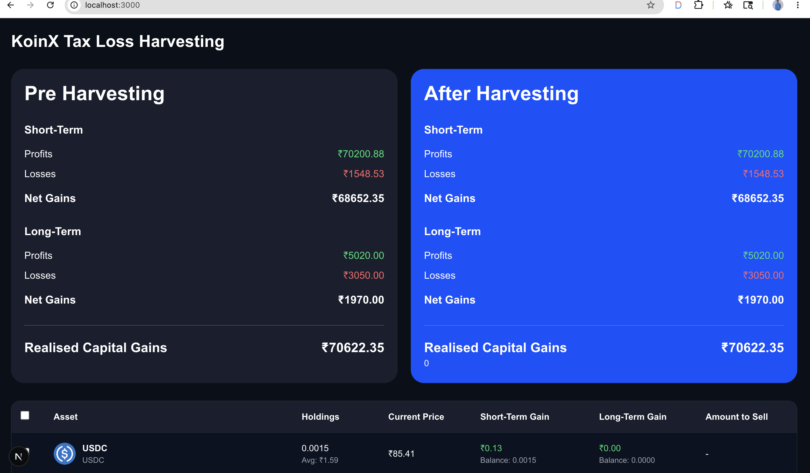
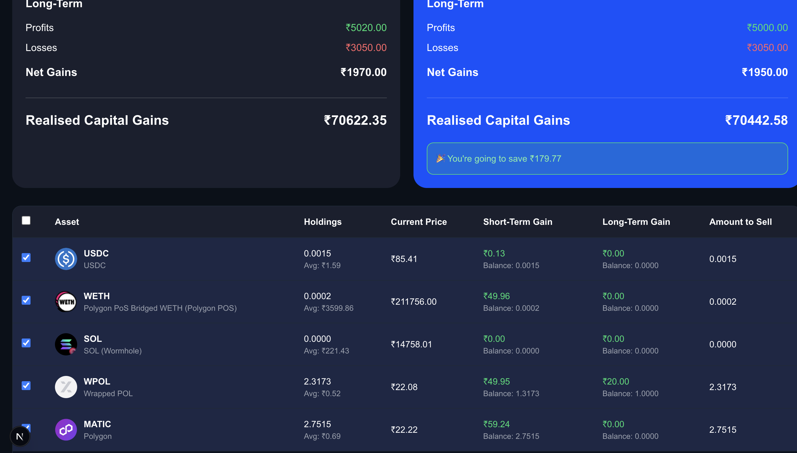
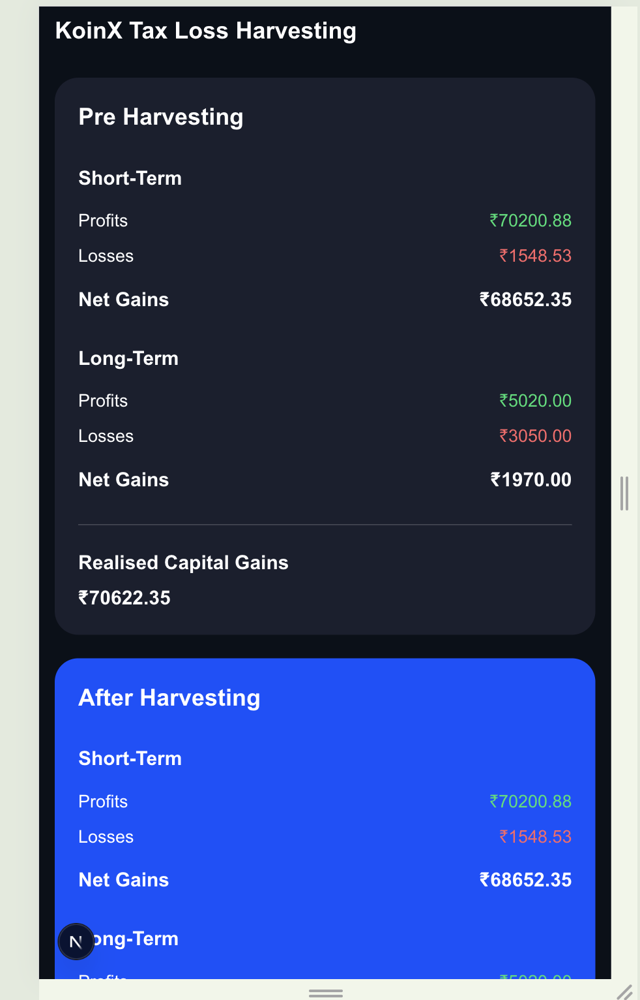

# KoinX Tax Loss Harvesting Dashboard

A responsive and interactive Tax Loss Harvesting Dashboard built using Next.js, React.js, TypeScript, and Tailwind CSS for the KoinX Frontend Intern Assignment.

---

## Features

- Pre Harvesting vs After Harvesting comparison
- Dynamic capital gains calculations
- Real-time checkbox updates
- Select/Deselect individual holdings
- Select All functionality
- Tax savings calculation
- Responsive UI design
- Loading state implementation
- Mock API integration
- Dark modern dashboard UI

---

## Tech Stack

- Next.js
- React.js
- TypeScript
- Tailwind CSS

---

## Functionalities

- Displays Short-Term and Long-Term capital gains
- Updates harvesting calculations dynamically
- Calculates realised capital gains
- Displays tax savings after harvesting
- Updates amount-to-sell automatically
- Responsive across desktop and mobile devices

---

## Setup Instructions
Clone repository:

```bash
git clone https://github.com/devivaraprasadbaratam-cpu/koinx-tax-harvesting.git
```

Move into project folder:

```bash
cd koinx-tax-harvesting
```

Install dependencies:

```bash
npm install
```

Run development server:

```bash
npm run dev
```

Open browser:

```text
http://localhost:3000
```

## Screenshots

### Dashboard UI



### Harvesting Selection



### Mobile Responsive View



## Assumptions

- Mock APIs are implemented locally using static JSON data.
- Positive gains reduce taxable profits during harvesting.
- Negative gains increase losses during harvesting.
- Holdings data is assumed to be static for assignment purposes.
- Tax calculations are simulated for demonstration purposes only.

## Deployment

Deployed using Vercel.

---

## Author

Devi Vara Prasad Baratam


